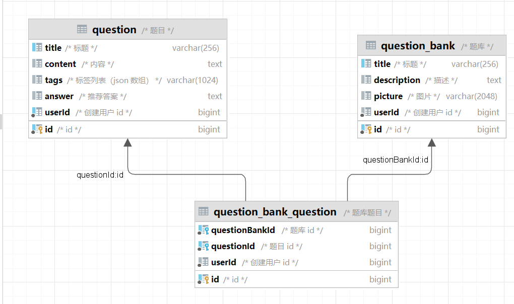

| 表名                   | 字段名         | 数据类型      | 备注                |
| ---------------------- | -------------- | ------------- | ------------------- |
| question               | title          | varchar(256)  | 标题                |
|                        | content        | text          | 内容                |
|                        | tags           | varchar(1024) | 标签列表 (JSON数组) |
|                        | answer         | text          | 推荐答案            |
|                        | userId         | bigint        | 创建用户id          |
|                        | id             | bigint        | id                  |
| question_bank          | title          | varchar(256)  | 标题                |
|                        | description    | text          | 描述                |
|                        | picture        | varchar(2048) | 图片                |
|                        | userId         | bigint        | 创建用户id          |
|                        | id             | bigint        | id                  |
| question_bank_question | questionBankId | bigint        | 题库id              |
|                        | questionId     | bigint        | 题目id              |
|                        | userId         | bigint        | 创建用户id          |
|                        | id             | bigint        | id                  |

