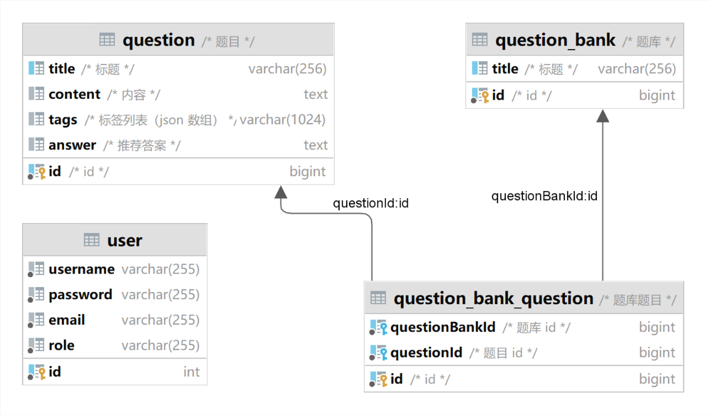

| 表名                   | 字段名         | 数据类型      | 备注                |
| ---------------------- | -------------- | ------------- | ------------------- |
| question               | title          | varchar(256)  | 标题                |
|                        | content        | text          | 内容                |
|                        | tags           | varchar(1024) | 标签列表 (JSON数组) |
|                        | answer         | text          | 推荐答案            |
|                        | ~~userId~~     | ~~bigint~~    | ~~创建用户id~~      |
|                        | id             | bigint        | 自增主键            |
| question_bank          | title          | varchar(256)  | 标题                |
|                        |~~description~~ |~~text~~       |~~描述~~             |
|                        | ~~picture~~    |~~varchar(2048)~~|~~图片~~           |
|                        | ~~userId~~     | ~~bigint~~    | ~~创建用户id~~      |
|                        | id             | bigint        | 自增主键            |
| question_bank_question | questionBankId | bigint        | 题库id              |
|                        | questionId     | bigint        | 题目id              |
|                        | ~~userId~~     | ~~bigint~~    | ~~创建用户id~~      |
|                        | id             | bigint        | 自增主键            |

| 表名 | 字段名   | 数据类型     | 备注     |
| :--- | :------- | :----------- | :------- |
| User | id       | bigint       | 自增主键 |
|      | username | varchar(255) | 用户名   |
|      | password | varchar(255) | 密码     |
|      | email    | varchar(255) | 邮箱     |
|      | role     | varchar(255) | 角色     |

| 要点           | 实现方式                                          |           |
| -------------- | ------------------------------------------------ | --------- |
| 主键           | 用户id、题目id、题库id、题目题库关系id             | √         |
| 外键           | 题目题库关系表中questionBankId参照question_bank表中的id| √     |
| 索引           | 给题目的标题建新索引                              | √         |
| 存储过程       | 获取当前题目详情，调用的存储过程                   | √         |
| 增删改查       | 管理员题目管理、用户模糊查询                       | √         |
| 事务与并发控制 | 两张表同时修改，都成功或都回滚，数据库隔离级别为可重复读     | √      |
| 备份导出导入   | 导出题目与导入题目(csv)                            | √        |
| 触发器         | 删除question表数据时同步更新question_bank_question数据| √    |
| 视图           | 连接题目信息和所属题库名的视图                     | √       |
| 权限控制| 授予用户和管理员不同的操作权限，用户只允许搜索表，管理员可以对表进行增删改查 | √ |
| 特色功能       | 1.邮箱验证码   2.密码md5加密存储 3.打包部署，公网ip直接访问               | √√√        |
|                |                                                  |            |