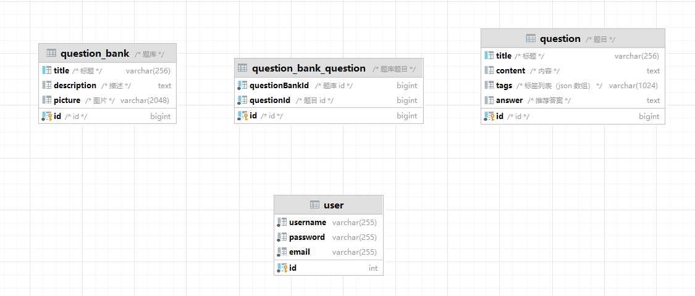

| 表名                   | 字段名         | 数据类型      | 备注                |
| ---------------------- | -------------- | ------------- | ------------------- |
| question               | title          | varchar(256)  | 标题                |
|                        | content        | text          | 内容                |
|                        | tags           | varchar(1024) | 标签列表 (JSON数组) |
|                        | answer         | text          | 推荐答案            |
|                        | ~~userId~~     | ~~bigint~~    | ~~创建用户id~~      |
|                        | id             | bigint        | 自增主键            |
| question_bank          | title          | varchar(256)  | 标题                |
|                        | description    | text          | 描述                |
|                        | picture        | varchar(2048) | 图片                |
|                        | ~~userId~~     | ~~bigint~~    | ~~创建用户id~~      |
|                        | id             | bigint        | 自增主键            |
| question_bank_question | questionBankId | bigint        | 题库id              |
|                        | questionId     | bigint        | 题目id              |
|                        | ~~userId~~     | ~~bigint~~    | ~~创建用户id~~      |
|                        | id             | bigint        | 自增主键            |

建表语句中  暂时去除 
题库表 题目表 题库题目表 的 外键约束 

方便功能开发与调试

| 表名 | 字段名   | 数据类型     | 备注     |
| :--- | :------- | :----------- | :------- |
| User | id       | bigint       | 自增主键 |
|      | username | varchar(255) | 用户名   |
|      | password | varchar(255) | 密码     |
|      | email    | varchar(255) | 邮箱     |

