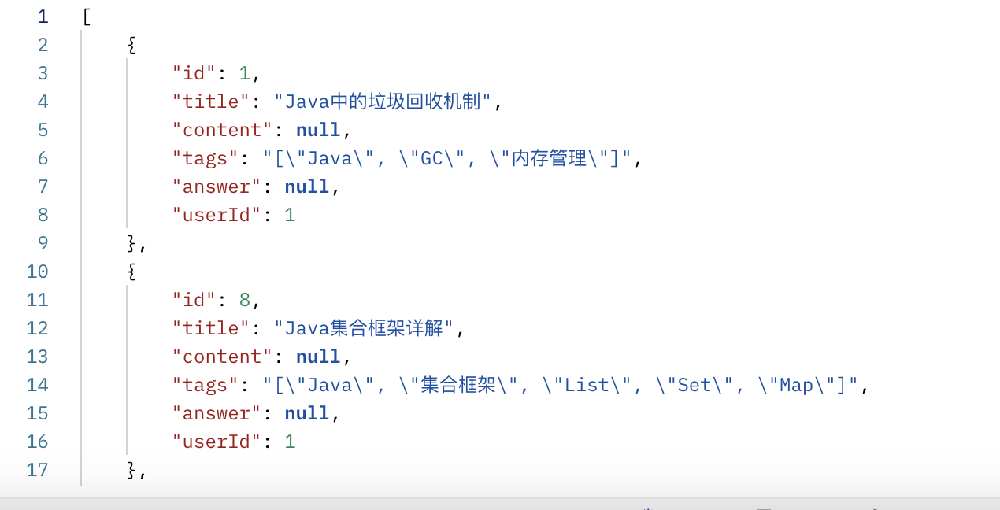
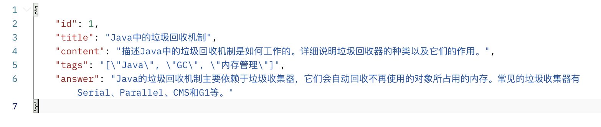
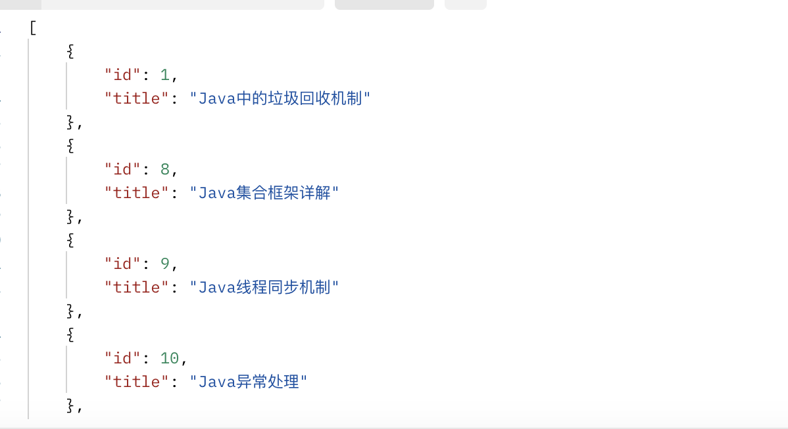

[TOC]

# 接口文档

## ip: localhost

| 描述                     | API                   | 类型 | 参数                                                         | 返回类型                                                     |
| ------------------------ | --------------------- | ---- | ------------------------------------------------------------ | ------------------------------------------------------------ |
| 用户登录                 | /user/login           | POST | {username: string, password:string}                          | 状态码                                                       |
| 用户注册                 | /user/register        | POST | {username: string, password: string, email: string}          | 状态码                                                       |
| 忘记密码                 | /user/changepwd       | POST | {email: string, password: string, captcha: string}           | 状态码                                                       |
| 获取验证码               | /user/getemailcode    | GET  | email: string                                                | 状态码                                                       |
| 获取题库列表             | /question/getbanklist | GET  | id:                                                          | 状态码                                                       |
| 获取当前题库题目概要信息 | /question/bankindex   | GET  | index: bank_index, pagesize: 当前页面容量, page: 当前页面（从1开始） | 返回状态码和如图所示列表，列表内为json格式数据，content和answer字段为null |

+ 获取当前选中题目具体信息

  | api      | /question/getcurrentquestion            |
  | -------- | --------------------------------------- |
  | 请求方式 | GET                                     |
  | params   | id: int                                 |
  | 返回形式 | json                                    |
  | 返回数据 |  |

  

+ 获取当前选择题目的同一题库的title（侧边栏）

  | api      | /question/getcurrenttitles               |
  | -------- | ---------------------------------------- |
  | 请求方式 | GET                                      |
  | params   | questionid: int                          |
  | 返回形式 | list                                     |
  | 返回数据 |  |

+ 获取当前题库的搜索结果

  | api      | /question/searchcontents            |
  | -------- | --------------------------------------- |
  | 请求方式 | GET                                     |
  | params   | content: 搜索内容,  page: 当前页面,pagesize: 当前页面容量,questionid: 根据当前题目得到所在题库                                 |
  | 返回形式 | 总数量total,list有id、title、tags|
  | 返回数据 | |

+ 获取所有题库的搜索结果

  | api      | /question/searchallcontents            |
  | -------- | --------------------------------------- |
  | 请求方式 | GET                                     |
  | params   | content: 搜索内容,  page: 当前页面,pagesize: 当前页面容量                                 |
  | 返回形式 | 总数量total,list有questionid、questiontitle、tags、banktitle|
  | 返回数据 | |
  
